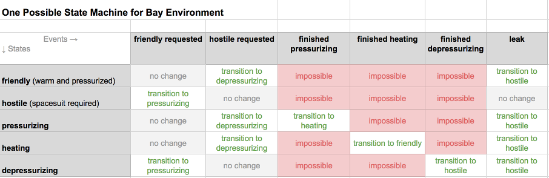
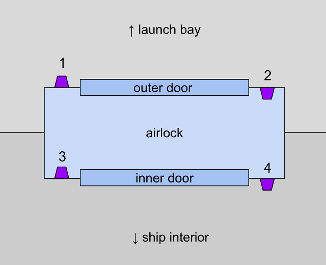
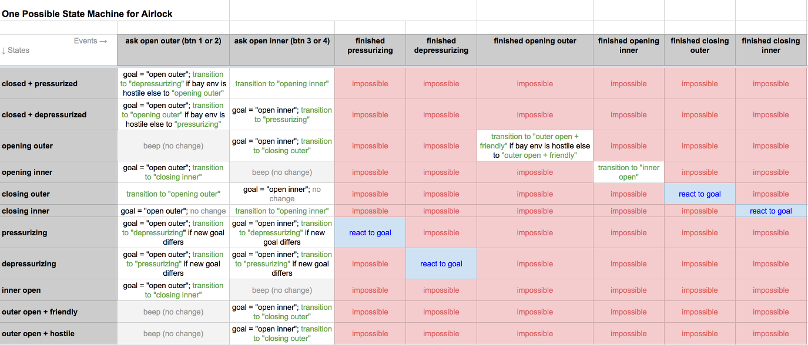
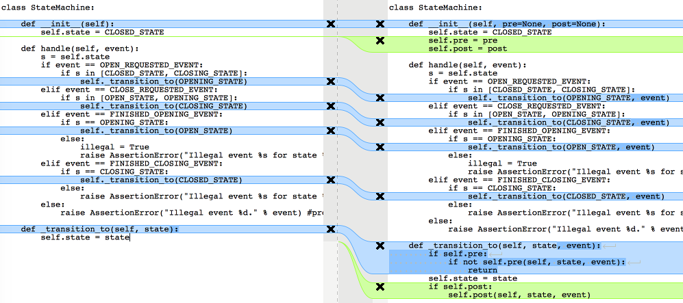
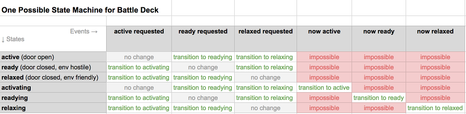
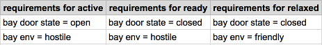

# distributed-state-machine

The consensus protocol on an Indy ledger is complex. Catchup is a
process all by itself, and so is view change. Yet these processes
interact with larger sequencing concerns, and there is an uber
consensus state that also merits state machine treatment. We have said
we want a state machine approach to all this complexity, but in a
discussion it became apparent that we may be thinking about it
differently. We are imagining a state machine at the individual node
level, but perhaps not a distributed state machine covering the ledger
as a whole.

I wanted to describe what I am imagining, as a way to see if we can all
get on the same page about where state machines are useful, and how they
can be implemented, nested, and distributed without losing their
usefulness. I also wanted to talk about how we can test state machines
at the unit-test level, giving near-perfect confidence that in parts of
the system, behavior is exactly what we want. (I do not believe a
complex system can be exercised perfectly, just by unit tests. There are
emergent effects. But I think we can test correctness to a far higher
confidence than we currently do.)

## Example

I want to separate this tiered-and-distributed problem from the
consensus protocol so we can talk about techniques in the abstract. But
I also want an easy, tangible example. So consider this situation. We
have a giant spaceship like the ones in Star Wars. This spaceship is
like an aircraft carrier; it contains bunches of smaller, one-man
fighters, and it needs to be able to launch these fighters into combat.
The fighters normally sit in a launch bay, where mechanics can work on
them in normal clothes. However, sometimes the launch bay is
depressurized, in which case the only way to enter from inside the
larger ship is to pass through an airlock in a space suit. We have 4
airlocks, A, B, C, and D--and one launch bay door, E. It looks something
like this:

There are at least interesting three state machine types in this
situation:

* The state machine for the bay door E.
* The state machines for the airlocks A, B, C, and D.
* The state machine the controls the bay environment, (de)pressurizing
  and heating the launch bay.

You can see that these state machines interact with each other. We don’t
want to be able to open both sides of an airlock if the launch bay is
depressurized. We don’t want to be able to open a bay door if the launch
bay isn’t depressurized. The airlocks have to coordinate with one
another and with the bay door to achieve consensus on a target state for
the launch bay. Furthermore, there can be a lag in transitions, and
timeouts can occur, just like there are timing considerations in our
consensus algorithm.

Now, let’s describe each of the state machines in isolation, formally.
State machines consist of __states__ and __transitions__. Transitions
are triggered by __events__. Some events are triggered manually (e.g.,
someone pushes a button to cycle an airlock); others might be automatic
(e.g., once the bay door finishes opening, the bay door should
automatically go into an `open` state). A simple way to model state
machines is with a matrix, where states are rows, events are columns,
and transitions are the intersections or cells.

### Bay Door

Ignore the complexity of the cross-state-machine problem for a moment,
and just focus on the bay door. The essence of its state machine might
look like this:

(See [http://bit.ly/2KSVLCk](http://bit.ly/2KSVLCk) for an editable
version of all the matrices used here.)

State machines can also be modeled with UML diagrams of a DAG, where
states are nodes and transitions are edges. I'm including the UML
equivalent here for reference. I like the matrix form better, because
it forces all combinations to be explicitly considered.

Notice that I said the state machine "might" look like this. There are
other ways to analyze the problem. For example, we could imagine a bay
door that can't reverse its state while it's in motion. This would
simplify the matrix, eliminating the transition in the `opening state +
close requested` cell. One of the big values of building state machines
is that it forces debate about these choices; this is a benefit I'm
hoping for as we analyze systems and subsystems of the consensus
protocol.

The code to implement this state machine is incredibly simple (see
[bay_door_v1.py](bay_door_v1.py)). We can write unit tests that prove
perfection in the implementation (see [test_bay_door_v1.py](
test_bay_door_v1.py)). With less than 90 lines of code, I can do both
both.

Before I talk about how the state machines interact, and how we might
have to implement business logic with regards to them, let's propose
state machines for the other two types as well.

### Bay Environment

The bay environment could have a state that's warm and pressurized, that
we can call `friendly`; this would be suitable for people to walk around
in a normal uniform. The opposite state would require a spacesuit; let's
call that `hostile`. This suggests a state machine such as:

This is simple enough that it's not worth providing sample code; its
implementation would be a minor variation on the bay door code.

### Airlock

The state for airlocks is the most complex. Airlocks never open a door
until the pressure on both sides is equal. They have an inner and
outer door, and 4 buttons that can be used to open the door at the place
where a person wants to pass through -- push button 1 if you're in the
launch bay and you want to open the outer door to enter the airlock,
button 3 if you're inside the airlock and want to go to the ship
interior, and so forth. When you ask for a door to be opened, the
airlock automatically decides how to change the pressure in the space
between its two doors, such that the target door is safe to open. Maybe
no changes are needed, in which case the door opens immediately.
Otherwise, pressure is equalized first.

The state machine for this airlock might look like this:

This state machine isn't just more complicated because it's bigger; it
introduces two new ideas:

* The notion of conditional transitions -- going to different states
depending on external conditions. (Example: in the `closed + pressurized`
state, if the `ask open outer` event occurs, the airlock transitions to
the `depressurizing` state if the bay environment is hostile, or to the
`opening outer` state if the bay environment is also pressurized.)
* The notion of a __goal__--something the state machine can't achieve
immediately, but that it will keep working on until it succeeds or until
its goal changes. A goal does not vary with external conditions, but it
may cause different reactions as external conditions change.

A working implementation of this state machine is shown in
[airlock.py](airlock.py); see also [test_airlock.py](test_airlock.py).

## Complications

Now that we have all the low-level pieces, let's make the problem a
bit harder.

### Business Logic

First, let's observe that we might have to execute some business logic
whenever a transition occurs (e.g., to log the change, or to turn on a
light or sound a klaxon). In fact, some of this business logic might
have to happen _before_ the transition, and it might even change
behavior--what if we don't want to allow the bay door to open in the
middle of a battle?

__If we model this issue correctly, it has almost NO effect on the
state machine code.__ I can't emphasize this enough. The state machine
was already correct; _complex business logic doesn't change it unless we
discover new states or new transitions_. Instead, we make transitions
hookable by adding the ability to invoke a __pre handler__ that can
take actions before the transition (including a veto), and a __post
handler__ that can take actions after the transition has completed.
Compare [bay_door_v1.py](bay_door_v1.py) and [bay_door_v2.py](
bay_door_v2.py):

The tests now have to prove that these hooks actually get invoked, and
that the pre hook actually has the power to veto a transition. Besides
this change, they are virtually identical: [test_bay_door_v2.py](
test_bay_door_v2.py).

In production code, I would not expect any of the three state machines
I've described above to get any more complicated that what I'm showing
here, no matter how complicated the business logic. An airlock might
trigger pumps, flashing lights, an audit log, a bell tone, a security
lockout procedure, or any number of other things when someone presses
a button. All of this logic would live in a business logic module that
gets invoked when a transition is proposed or completed (or both). The
state machine itself is provably correct and very stable as the code
evolves--and the business logic, no matter how complicated it gets,
still has to boil all of its actions down to a binary outcome--will the
transition be allowed, or not?

### Interactions

Now we are in a position to ask the hardest type of questions: _How
can we model the complex interactions among all these state machines?_
After all, nothing that we've done so far helps us code for the case
where someone presses button 2 on airlock B, expecting a friendly
environment to exist in the bay--but the bay door is open. Nothing helps
us interrupt airlock cycling if a leak develops in the bay during
battle. These are the types of issues that make state machines in our
consensus algorithm so tricky.

Let's assume that it takes far longer to pressurize or depressurize the
entire bay than it does to pressurize or depressurize an airlock--and
that canceling an airlock operation is just an annoyance, whereas
canceling a bay environment operation is slow, expensive, and might
interfere with life-or-death movement of fighters during battle. Let's
further assume that opening or closing the bay door is faster than
pressurizing or depressurizing the bay, but not as fast as cycling an
airlock. For this reason, during battle the preference is to keep the
airlock in a depressurized (`hostile`) state. This suggests that we
might want to implement logic like:

1. The preferred state of the overall system is to keep the bay
environment stable (leaving it `hostile` if it's already `hostile`, or
`friendly` if it's already `friendly`). The bay env is nearly always
`friendly` unless the ship declares a red alert.

2. If the bay environment is hostile, the bay may open or close its door
at any time. If the bay environment is in any other state, it must first
transition to `hostile` before the bay can open its door.

3. No airlock can open an outer door into the bay when the bay env is in
a `pressurizing` or `depressurizing` state.

4. As soon as the bay environment leaves the `friendly` state, all
airlocks receive a signal about it. If they were in the middle of
cycling on the assumption that the bay was `friendly`, they now reverse
that assumption and assume it is `hostile`. Likewise, as soon as the
bay environment leaves the `hostil`e state, all airlocks receive a
signal and react as if the bay environment were friendly. However, the
airlocks can't complete any sequences that lead to doors opening until
the bay environment fully changes. This means someone might have to wait
an extra minute or two in an airlock.

We could implement all of this logic in the same business logic modules
that turn on lights or klaxons or record audit logs of activity for
the individual state machines. However, I think the cleaner approach
is to define a new, higher-level system, and to define a state machine
for it as well. One reason I think this is the right way to solve the
problem is that state machines are composible in this way in "real
life." The state machine for a vending machine's delivery apparatus and
the state machine for a vending machine's receive-money-and-make-change
subsystem interact in a larger state machine for the vending machine as
a whole; it's the larger state machine that puts the payment subsytem
into an inert state while the delivery mechanism is dropping a can of
soda or a bag of chips into the opening where it can be retrieved.

So let's imagine that this launch bay and its airlocks and environment
are all part of the ship's __battle deck__ uber system. The battle deck
can send signals to its subsystems to help them react to its broader
goals. We could model it like this:

Note also the requirements imposed on subsytems in order to achieve
each state:

There are no requirements about the _state_ of airlocks, because the
needs of the battle deck trump whatever an airlock might be doing. This
complicates the _implementation_ of airlocks, but simplifies some of our
business logic.

Notice some other subtleties:

* The battle deck thinks about itself as a single coherent system, as
far as the state machine is concerned. A substantial amount of change
might have to take place to ready the battle deck for action, or to
relax when a battle is over--but at this level of detail, that change
is not modeled. However, the business logic on hooks for this state
machine will certainly need to interact with the state machines of the
subsystems.

* When a new state is requested, the battle deck state machine
transitions immediately into a state of attempting to reach the new
state. I could have implemented this with the goal mechanism that I
used with airlocks, but for completeness of our exploration I took an
alternative approach where the target state implies the goal. Though
this state machine may have to pass through an intermediate state on the
way to final target (e.g., it may have to close the bay's outer door on
the journey from `active` to `relaxed`), its state doesn't change until
its goal changes or is achieved. It is not obvious to me which approach
is better, goals or states that imply goals; I see tradeoffs either way.

### Signalling Airlocks

Suppose that Alice is wearing an ordinary uniform instead of a space
suit, and that she's currently in airlock B, hoping to enter the launch
bay. She's already pressed button 2, and the airlock is currently in
the `opening outer` state with the goal of achieving `outer open
friendly`.

Now the ship goes to red alert. The battle deck state machine receives
a `ready requested` event. It immediately transitions to a `readying`
state. Its business logic uses a `post` hook to coordinate reactions
to this event in all the subsystems. Specifically, it sends an immediate
signal to any airlocks that have the outer door fully or partly open
(and which would be pressurized since the bay env is starting in a
friendly state) that the outer door must close and that any goal beyond
closing that door must be canceled. It does this by sending the `ask
open inner` event to each such airlock.

Alice, who was about to step through the outer door of B into the bay,
now sees her outer door slide the other direction and close. If she
interprets this surprising action as being caused by a glitch instead of
understanding that a red alert has overridden her request, she may
pound on button 2 again, hoping to override. However, when she does, the
business logic attached by a hook to B's state machine will fire a `pre`
handler that checks the state of the larger battle deck. Seeing that the
battle deck is in a `ready requested` state, it realizes that the entire
bay environment is transitioning; an internal airlock's wishes must be
deferred. So Alice pounding on button 2 has no effect (`pre` returns
False to deny the request.)

As soon as the outer door of B closes in front of Alice, the inner door
back into the hallways of the ship opens, and the airlock achieves a
stable `inner open` state. Alice can now press button 2 again, and the
airlock will try to honor her request--but it will do so knowing that
it has to depressurize because that's the state that the bay environment
on the other side of the outer door will be achieving.

## Applying this to consensus

I understand the problem that Alex and Sergey highlighted in our recent
architecture chat--we can't afford to refactor all aspects of our system
into state machines. We can only do incremental refactors, a modest
amount at a time. However, I recommend that we do the following:

* Build a matrix representing the state machine for each system and
subsystem in the PBFT version of the algorithm. Even if we don't
implement all of the state machines right away, the act of analyzing
each of them will bring certain questions to light, and teach us a lot.

* Implement as much of the PBFT rewrite using state machines as is
practical.

* Unit test our state machines in more or less the way I've shown in the
sample code.

* Avoid complicating state machines with business logic. Move all of
that logic out of the state machine itself, and instead hook the logic
with `pre` and `post` handlers for events.

One difference between my battle deck system and the one we have to
build for consensus is that the battle deck system is centralized
whereas the consensus state is duplicated on each node. I think this is
noteworthy, but not fatal to what I'm recommending. We can say that
transitions in the uber state machine for consensus only succeed when
we see enough evidence to know that consensus has occurred. Is that
too simplistic?

If you agree with this general approach, then I am very eager to see the
matrices that capture the various state machines in your analysis.