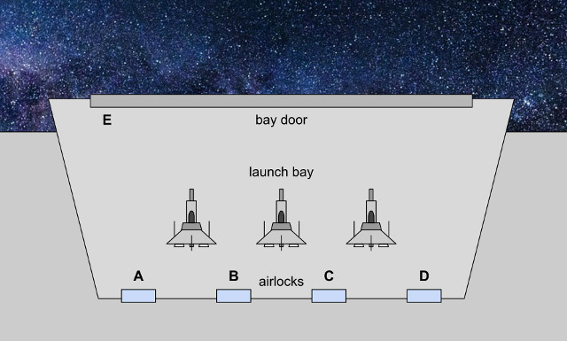
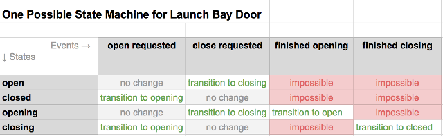
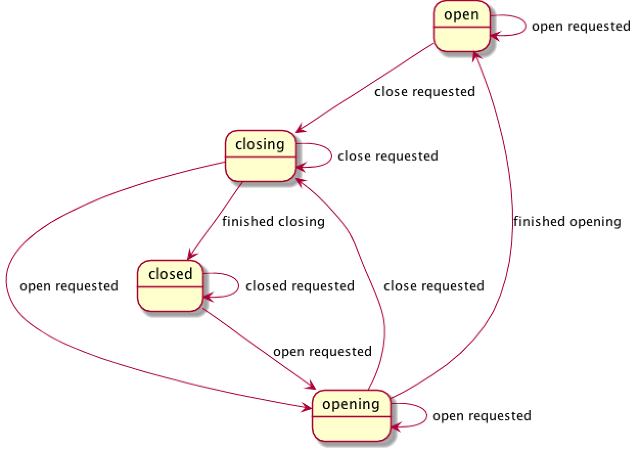

# distributed-state-machine

The consensus protocol on an Indy ledger is complex. Catchup is a
process all by itself, and so is view change. Yet these processes
interact with larger sequencing concerns, and there is a larger
consensus state that also merits a state machine treatment. We have said
we want a state machine approach to all this complexity, but in a
discussion it became apparent that we may be thinking too narrowly. We
are imagining a state machine at the individual node level, but perhaps
not a distributed state machine covering the ledger as a whole.

I wanted to describe what I am imagining, as a way to see if we can all
get on the same page about where state machines are useful, and how they
can be nested and distributed without losing their usefulness. I also
wanted to talk about how we can test state machines at the unit-test
level, giving near-perfect confidence that in parts of the system,
behavior is exactly what we want. (I do not believe a complex system can
be exercised perfectly, just by unit tests. There are emergent effects.
But I think we can test correctness to a far higher confidence than we
currently do.)

I want to separate this tiered-and-distributed problem from the
consensus protocol so we can talk about it in the abstract. But I also
want an easy, tangible example. So consider this situation. Imagine we
have a giant spaceship like the ones in Star Wars. This spaceship is
like an aircraft carrier; it contains bunches of smaller, one-man
fighters, and it needs to be able to launch these fighters into combat.
The fighters normally sit in a launch bay, where mechanics can work on
them in normal clothes. However, sometimes the launch bay is
depressurized, in which case the only way to enter from inside the
larger ship is to pass through an airlock in a space suit. We have 4
airlocks, A, B, C, and D--and one launch bay door, E. It looks something
like this:

There are at least interesting three state machine types in this situation:

* The state machine for the bay door E.
* The state machines for the airlocks A, B, C, and D.
* The state machine for the launch bay itself.

You can see that these state machines interact with each other. We don’t
want to be able to open both sides of an airlock if the launch bay is
depressurized. We don’t want to be able to open a bay door if the launch
bay isn’t depressurized. The airlocks have to coordinate with one
another and with the bay door to achieve consensus on a target state for
the launch bay. Furthermore, there may be a lag in transitions, and
timeouts, just like there are timing considerations in our consensus
algorithm.

Now, let’s describe each of the state machines in isolation, formally.
State machines consist of __states__ and __transitions__. Transitions are
triggered by __events__. A simple way to model them is with a matrix,
where states are rows, events are columns, and transitions are the
intersections or cells.

Ignore the complexity of the interacting state machines for a moment,
and just focus on the bay door. Its state machine might look like this:

(State machines can also be modeled with UML diagrams of a DAG, where
states are nodes and transitions are edges. I like the matrix approach
better because the diagram doesn’t have a good way to distinguish
between events and transitions.)

The code to implement this state machine is incredibly simple (see
[bay_door_v1.py](bay_door_v1.py)). We can write unit tests that prove
perfection in the implementation (see [test_bay_door_v1.py](test_bay_door_v1.py)).

