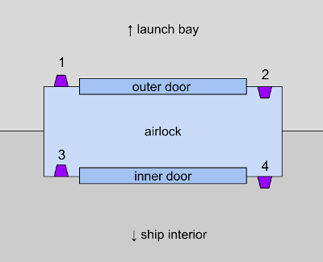
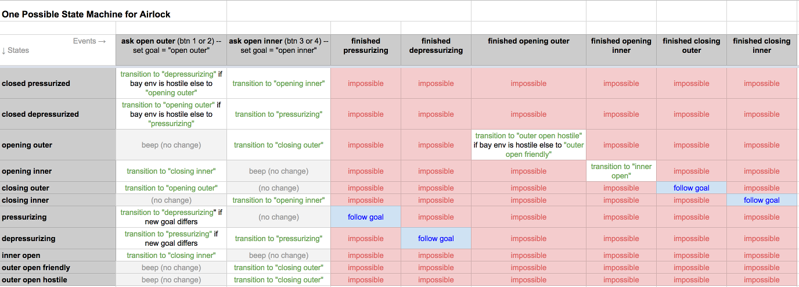

# distributed-state-machine

The consensus protocol on an Indy ledger is complex. Catchup is a
process all by itself, and so is view change. Yet these processes
interact with larger sequencing concerns, and there is an uber
consensus state that also merits state machine treatment. We have said
we want a state machine approach to all this complexity, but in a
discussion it became apparent that we may be thinking about it
differently. We are imagining a state machine at the individual node
level, but perhaps not a distributed state machine covering the ledger
as a whole.

I wanted to describe what I am imagining, as a way to see if we can all
get on the same page about where state machines are useful, and how they
can be implemented, nested, and distributed without losing their
usefulness. I also wanted to talk about how we can test state machines
at the unit-test level, giving near-perfect confidence that in parts of
the system, behavior is exactly what we want. (I do not believe a
complex system can be exercised perfectly, just by unit tests. There are
emergent effects. But I think we can test correctness to a far higher
confidence than we currently do.)

## Example

I want to separate this tiered-and-distributed problem from the
consensus protocol so we can talk about techniques in the abstract. But
I also want an easy, tangible example. So consider this situation. We
have a giant spaceship like the ones in Star Wars. This spaceship is
like an aircraft carrier; it contains bunches of smaller, one-man
fighters, and it needs to be able to launch these fighters into combat.
The fighters normally sit in a launch bay, where mechanics can work on
them in normal clothes. However, sometimes the launch bay is
depressurized, in which case the only way to enter from inside the
larger ship is to pass through an airlock in a space suit. We have 4
airlocks, A, B, C, and D--and one launch bay door, E. It looks something
like this:

There are at least interesting three state machine types in this
situation:

* The state machine for the bay door E.
* The state machines for the airlocks A, B, C, and D.
* The state machine the controls the bay environment, (de)pressurizing
  and heating the launch bay.

You can see that these state machines interact with each other. We don’t
want to be able to open both sides of an airlock if the launch bay is
depressurized. We don’t want to be able to open a bay door if the launch
bay isn’t depressurized. The airlocks have to coordinate with one
another and with the bay door to achieve consensus on a target state for
the launch bay. Furthermore, there can be a lag in transitions, and
timeouts can occure, just like there are timing considerations in our
consensus algorithm.

Now, let’s describe each of the state machines in isolation, formally.
State machines consist of __states__ and __transitions__. Transitions
are triggered by __events__. A simple way to model them is with a
matrix, where states are rows, events are columns, and transitions are
the intersections or cells.

### Bay Door

Ignore the complexity of the cross-state-machine problem for a moment,
and just focus on the bay door. The essence of its state machine might
look like this:

(See [http://bit.ly/2KSVLCk](http://bit.ly/2KSVLCk) for an editable
version of all the matrices used here.)

State machines can also be modeled with UML diagrams of a DAG, where
states are nodes and transitions are edges. I'm including the UML
equivalent here for reference. I like the matrix form better, because
it forces all combinations to be explicitly considered.

Notice that I said the state machine "might" look like this. There are
other ways to analyze the problem. For example, we could imagine a bay
door that can't reverse its state while it's in motion. This would
simplify the matrix, eliminating the transition in the `opening state +
close requested` cell. One of the big values of building state machines
is that it forces debate about these choices; this is a benefit I'm
hoping for as we analyze systems and subsystems of the consensus
protocol.

The code to implement this state machine is incredibly simple (see
[bay_door_v1.py](bay_door_v1.py)). We can write unit tests that prove
perfection in the implementation (see [test_bay_door_v1.py](
test_bay_door_v1.py)). With less than 90 lines of code, I can do both
both.

Before I talk about how the state machines interact, and how we might
have to implement business logic with regards to them, let's propose
state machines for the other two types as well.

### Airlock

The one for airlocks is the most complex. Airlocks have an inner and
outer door, and 4 buttons that can be used to open the door at the place
where a person wants to pass through -- push button 1 if you're in the
launch bay and you want to open the outer door to enter the airlock,
button 3 if you're inside the airlock and want to go to the ship
interior, and so forth:

The state machine for this airlock might look like this:

I didn't write the code to implement this state machine, but it would
be just a more complex instance of the same patterns shown in the
earlier one.

### Bay Environment

The bay environment could be modeled like this:

## Complications

Now that we have all the low-level pieces, let's make the problem a
bit harder.

### Business Logic

First, let's observe that we might have to execute some business logic
whenever a transition occurs (e.g., to log the change, or to turn on a
light or sound a klaxon). In fact, some of this business logic might
change behavior--what if we don't want to allow the bay door to open in
the middle of a battle?

__If we model this issue correctly, it has almost NO effect on the
state machine code.__ I can't emphasize this enough. The state machine
was already correct; complex business logic doesn't change it unless we
discover new states or new transitions. Instead, we make transitions
hookable by adding the ability to invoke a __pre handler__ that can
veto the transition, and a __post handler__ that can take actions after
the transition has completed. Compare [
bay_door_v1.py](bay_door_v1.py) and [bay_door_v2.py](bay_door_v2.py):

The tests now have to prove that these hooks actually get invoked, and
that the pre hook actually has the power to veto a transition. Besides
this change, they are virtually identical: [test_bay_door_v2.py](
test_bay_door_v2.py).